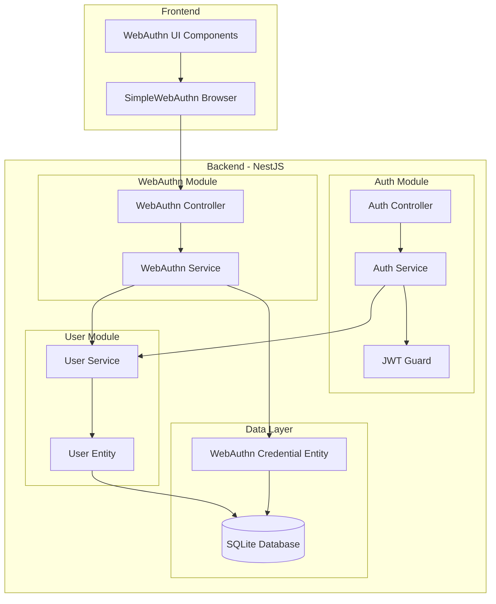

# Design Document

## Overview

This design implements WebAuthn integration using the SimpleWebAuthn library (@simplewebauthn/server v13.1.2) to extend the existing NestJS authentication system. The implementation will create a dedicated WebAuthn module that works alongside the current JWT-based authentication, allowing users to register and authenticate using biometric devices, security keys, and other WebAuthn-compatible authenticators.

The design leverages the existing User entity structure (which already includes `userHandle` and `currentChallenge` fields) and integrates seamlessly with the current authentication flow while maintaining backward compatibility.

## Architecture

### High-Level Architecture



### Integration Points

1. **Authentication Flow Integration**: WebAuthn authentication will generate JWT tokens using the same mechanism as password-based authentication
2. **User Management**: WebAuthn credentials will be associated with existing User entities
3. **Security**: Leverages existing JWT strategy and guards for protected endpoints

## Components and Interfaces

### WebAuthn Module Structure

```typescript
// webauthn.module.ts
@Module({
  imports: [TypeOrmModule.forFeature([WebAuthnCredential]), UserModule],
  controllers: [WebAuthnController],
  providers: [WebAuthnService],
  exports: [WebAuthnService],
})
export class WebAuthnModule {}
```

### WebAuthn Service Interface

```typescript
interface IWebAuthnService {
  // Registration flow
  generateRegistrationOptions(userId: number): Promise<PublicKeyCredentialCreationOptionsJSON>;
  verifyRegistration(userId: number, response: RegistrationResponseJSON): Promise<{ verified: boolean; credential?: WebAuthnCredential }>;
  
  // Authentication flow
  generateAuthenticationOptions(userHandle?: string): Promise<PublicKeyCredentialRequestOptionsJSON>;
  verifyAuthentication(response: AuthenticationResponseJSON): Promise<{ verified: boolean; user?: User }>;
  
  // Credential management
  getUserCredentials(userId: number): Promise<WebAuthnCredential[]>;
  deleteCredential(userId: number, credentialId: string): Promise<boolean>;
}
```

### Controller Endpoints

```typescript
// Registration endpoints
POST /webauthn/register/begin    // Generate registration options
POST /webauthn/register/finish   // Verify registration response

// Authentication endpoints  
POST /webauthn/authenticate/begin   // Generate authentication options
POST /webauthn/authenticate/finish  // Verify authentication response

// Credential management endpoints
GET /webauthn/credentials        // List user credentials (protected)
DELETE /webauthn/credentials/:id // Delete credential (protected)
```

## Data Models

### WebAuthn Credential Entity

```typescript
@Entity('webauthn_credentials')
export class WebAuthnCredential {
  @PrimaryGeneratedColumn()
  id: number;

  @Column({ unique: true })
  credentialID: string; // Base64URL encoded credential ID

  @Column('text')
  credentialPublicKey: string; // Base64URL encoded public key

  @Column({ default: 0 })
  counter: number; // Signature counter for replay protection

  @Column()
  credentialDeviceType: 'singleDevice' | 'multiDevice';

  @Column({ default: false })
  credentialBackedUp: boolean;

  @Column({ type: 'text', nullable: true })
  transports?: string; // JSON array of transport methods

  @Column({ type: 'text', nullable: true })
  deviceName?: string; // User-friendly device name

  @Column({ type: 'datetime', default: () => 'CURRENT_TIMESTAMP' })
  createdAt: Date;

  @Column({ type: 'datetime', default: () => 'CURRENT_TIMESTAMP' })
  lastUsed: Date;

  // Relationship with User
  @ManyToOne(() => User, { onDelete: 'CASCADE' })
  @JoinColumn({ name: 'userId' })
  user: User;

  @Column()
  userId: number;
}
```

### Updated User Entity

The existing User entity already has the necessary fields:
- `userHandle: Buffer` - WebAuthn user handle (already present)
- `currentChallenge?: string` - Current challenge for verification (already present)

### DTOs

```typescript
// Registration DTOs
export class BeginRegistrationDto {
  @IsNumber()
  userId: number;
  
  @IsOptional()
  @IsString()
  deviceName?: string;
}

export class FinishRegistrationDto {
  @IsNumber()
  userId: number;
  
  @IsObject()
  response: RegistrationResponseJSON;
}

// Authentication DTOs
export class BeginAuthenticationDto {
  @IsOptional()
  @IsString()
  userHandle?: string;
}

export class FinishAuthenticationDto {
  @IsObject()
  response: AuthenticationResponseJSON;
}
```

## Error Handling

### Error Types and Responses

```typescript
// Custom WebAuthn exceptions
export class WebAuthnRegistrationError extends BadRequestException {
  constructor(message: string) {
    super(`WebAuthn Registration Failed: ${message}`);
  }
}

export class WebAuthnAuthenticationError extends UnauthorizedException {
  constructor(message: string) {
    super(`WebAuthn Authentication Failed: ${message}`);
  }
}

export class WebAuthnCredentialNotFoundError extends NotFoundException {
  constructor() {
    super('WebAuthn credential not found');
  }
}
```

### Error Handling Strategy

1. **Registration Errors**: Return specific error messages for debugging while avoiding sensitive information leakage
2. **Authentication Errors**: Return generic "authentication failed" messages to prevent user enumeration
3. **Validation Errors**: Use class-validator for input validation with descriptive messages
4. **Database Errors**: Catch and transform database errors into appropriate HTTP responses

## Configuration

### Environment Variables

```typescript
// Configuration interface
interface WebAuthnConfig {
  rpName: string;           // Relying Party name
  rpID: string;             // Relying Party ID (domain)
  origin: string;           // Expected origin
  timeout: number;          // Timeout for operations (ms)
  requireResidentKey: boolean;
  userVerification: 'required' | 'preferred' | 'discouraged';
}

// Default configuration
const defaultConfig: WebAuthnConfig = {
  rpName: process.env.WEBAUTHN_RP_NAME || 'WebAuthn Demo',
  rpID: process.env.WEBAUTHN_RP_ID || 'localhost',
  origin: process.env.WEBAUTHN_ORIGIN || 'http://localhost:3000',
  timeout: parseInt(process.env.WEBAUTHN_TIMEOUT || '60000'),
  requireResidentKey: process.env.WEBAUTHN_REQUIRE_RESIDENT_KEY === 'true',
  userVerification: (process.env.WEBAUTHN_USER_VERIFICATION as any) || 'preferred',
};
```

## Testing Strategy

### Unit Testing

1. **Service Layer Tests**:
   - Test registration option generation with various user scenarios
   - Test registration verification with valid/invalid responses
   - Test authentication option generation
   - Test authentication verification
   - Test credential management operations

2. **Controller Layer Tests**:
   - Test all endpoints with valid/invalid inputs
   - Test authentication guards and authorization
   - Test error handling and response formats

3. **Entity Tests**:
   - Test WebAuthnCredential entity relationships
   - Test data validation and constraints

### Integration Testing

1. **End-to-End Registration Flow**:
   - Test complete registration process from option generation to credential storage
   - Test error scenarios (invalid responses, duplicate registrations)

2. **End-to-End Authentication Flow**:
   - Test complete authentication process from option generation to JWT token issuance
   - Test authentication with multiple credentials per user

3. **Database Integration**:
   - Test credential CRUD operations
   - Test user-credential relationships
   - Test cascade deletions

### Frontend Testing Strategy

1. **Browser Compatibility Tests**:
   - Test WebAuthn support detection
   - Test graceful fallback for unsupported browsers

2. **User Interaction Tests**:
   - Test registration flow UI
   - Test authentication flow UI
   - Test credential management UI

## Security Considerations

### Challenge Management

- Generate cryptographically secure random challenges using SimpleWebAuthn's built-in utilities
- Store challenges temporarily in the User entity's `currentChallenge` field
- Implement challenge expiration (60-second timeout)
- Clear challenges after successful verification

### Credential Storage

- Store only public key data, never private keys
- Use Base64URL encoding for credential IDs and public keys
- Implement proper database constraints to prevent duplicate credentials
- Associate credentials with users through foreign key relationships

### Origin and RP ID Validation

- Validate origin matches expected domain
- Ensure RP ID matches the domain serving the application
- Implement strict origin checking in verification process

### Counter-based Replay Protection

- Store and validate signature counters for each credential
- Increment counters on successful authentication
- Detect and reject potential replay attacks

## Frontend Integration Design

### Browser Library Integration

```typescript
// Frontend service structure
class WebAuthnService {
  async registerCredential(userId: number, deviceName?: string): Promise<boolean>;
  async authenticateWithCredential(): Promise<{ success: boolean; token?: string }>;
  async listCredentials(): Promise<WebAuthnCredential[]>;
  async deleteCredential(credentialId: string): Promise<boolean>;
  
  // Utility methods
  isWebAuthnSupported(): boolean;
  private handleWebAuthnError(error: Error): string;
}
```

### UI Components

1. **Registration Component**: Button to initiate WebAuthn registration with device name input
2. **Authentication Component**: WebAuthn login button as alternative to password login
3. **Credential Management Component**: List of registered devices with delete functionality
4. **Error Display Component**: User-friendly error messages for WebAuthn operations

### Integration with Existing Auth Flow

- WebAuthn authentication will return JWT tokens compatible with existing auth guards
- Frontend will store JWT tokens using the same mechanism as password-based auth
- WebAuthn login will redirect to the same post-login routes as password login